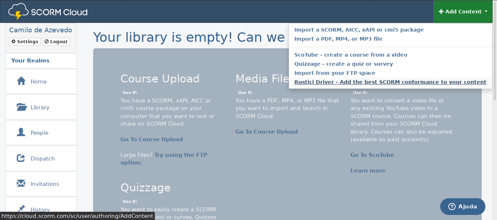
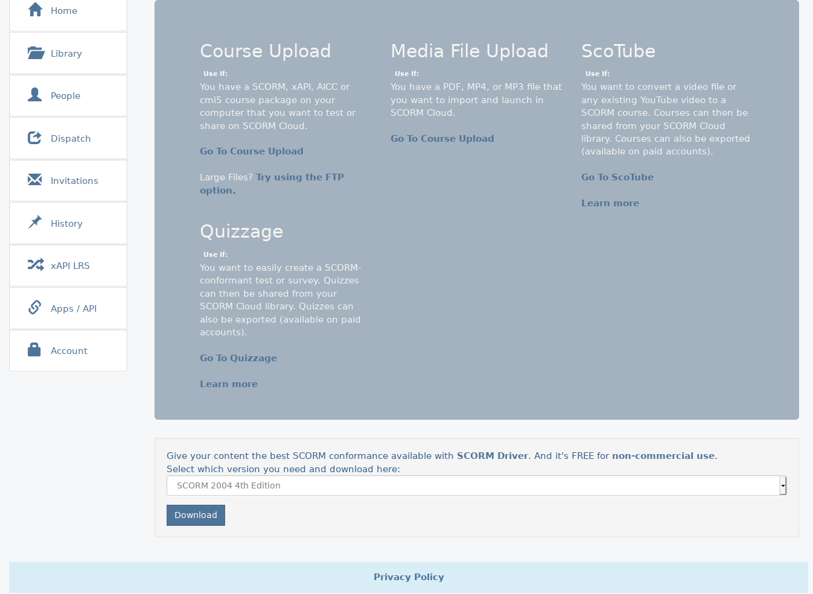

# Como instalar o driver

Aqui vamos aprender como baixar e instalar o driver do SCORM, além de como por esse driver junto com o HTML. Isso vai depender de como a sua empresa trabalha, mas podemos começar criando uma conta e logando em:

###  cloud.scorm.com

SCORM cloud é uma plataforma que foi construída primariamente para testar o conteúdo em SCORM depois de exportado e checar o quão funcional ele está, além de ter muitas outras ferramentas disponíveis para quem trabalha com SCORM. Ele também tem funções e suporte para a específicação mais recente xAPI.

Em **Biblioteca** (Library) estão todos os cursos que foram feito upload para plataforma e também é por onde é possível baixá-los ou enviar novos cursos.

Para obtermos o driver temos que clicar no canto direito superior em **Adicionar Conteúdo** (Add Content) e selecionar a opção "Rustici Driver".

Na página que o link abre bem ao final da mesma terá um Dropdown para selecionar o driver da **versão do SCORM** ou qual outra especificação deve ser suportada entre as seguintes: 

- SCORM 1.2
- SCORM 2004 2nd Edition
- SCORM 2004 3rd Edition
- SCORM 2004 4th Edition
- AICC
- Tin Can (xAPI compatible)

No momento vamos trabalhar com "SCORM 2004 4th Edition" selecione-a e clique em Baixar (Download).

Será baixado um .zip com o Driver.
