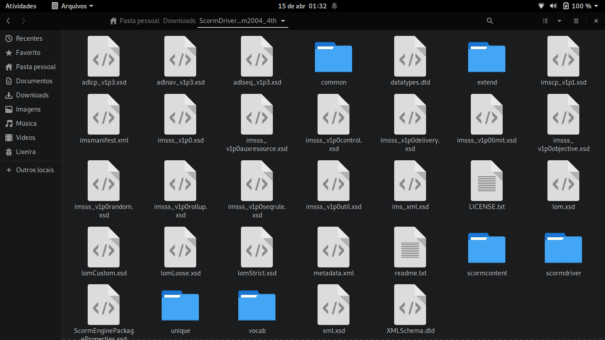

# Explorando os Arquivos do Driver do SCORM

Agora que baixamos o arquivo, vamos dar uma olhada nos arquivos que vieram com o arquivo zip baixado. Quando fazemos a extração do arquivo vamos ter múltiplos arquivos e pastas.



## pasta scormcontent

Para ter nosso conteúdo como SCORM devemos **adicioná-lo dentro dessas pastas e arquivos** e para isso a pasta que é mais importante e que mais vamos trabalhar é a **scormcontent**, vamos abrir essa pasta, dentro dela existe apenas um único arquivo **index.html** e seu conteúdo nada mais é que apenas:

```html
<!DOCTYPE html PUBLIC "-//W3C//DTD HTML 4.01//EN" "http://www.w3.org/TR/html4/strict.dtd">
<html><body>

Your content goes in the scormcontent folder.

</body></html>
```

Dentro dessa pasta é onde vai ficar todos os conteúdos do curso em páginas HTML que serão lidas pelo LMS e a página nomeada como index é a que será chamada primeiro ao abrir o conteúdo.

## pasta scormdriver

A pasta **scormdriver** contêm alguns arquivos e podemos notar que ela também possui uma página chamada **indexAPI** com o seguinte conteúdo:

```html
<!DOCTYPE html>
<html>
<!--/* Copyright � 2003-2013 Rustici Software, LLC  All Rights Reserved. www.scorm.com - See LICENSE.txt for usage restrictions */-->
	<head>
		<title></title>
		<script language="JavaScript1.2" src="scormdriver.js"></script>
		<script language="JavaScript1.2">
			strContentLocation = "../scormcontent/index.html";  //Put the link to the start of the content here.

			function LoadContent(){
				//check for bookmark
				var bookmark = GetBookmark();

				if (bookmark != "") {
					//if there is a bookmark, then go to that page
					window.scormdriver_content.document.location.href = "../scormcontent/" + bookmark;
				}
				else {
					//if not, go to the start page
					window.scormdriver_content.document.location.href = strContentLocation;
				}
			}
		</script>
	</head>
	<!-- Don't change the names of these frames below. Doing so may break functionality -->
	<frameset rows="100%,0%,0%,0%" onload="Start()" onbeforeunload="Unload()" onunload="Unload()">
		<frame name="scormdriver_content" src="blank.html">
		<frame name="AICCComm" src="AICCComm.html">
		<frame name="rusticisoftware_aicc_results" src="blank.html">
		<frame name="NothingFrame" src="blank.html">
	</frameset>
	<noframes>
		Your browser must be able to view frames for this content to display.
	</noframes>
</html>
``` 
Talvez a linha mais importante de entermos agora é a que declara a variável **strContentLocation** que nada mais é que o caminho relativo (path) para o arquivo que irá iniciar o curso, permitindo-nos alterar o nome ou localização do arquivo index que vimos antes para qualquer nome ou local.

Ainda dentro de **scormdriver** vamos ver que existe uma pasta com o nome **auto-scripts** em que dentro dela existe três arquivos:

- **CourseExit.js**: Que é responsável por lidar com as ações de saída do aluno do conteúdo.
- **AutoCompleteSCO.js**: Que é responsável pelas funções de completar o progresso do aluno.
- **AutoBookmark.js**: Que é responsável pelas funções de salvar do aluno.

Esses arquivos servem para serem chamados e executar as ações necessárias quando os eventos do tipo descrito no nome do arquivo são necessários. 
