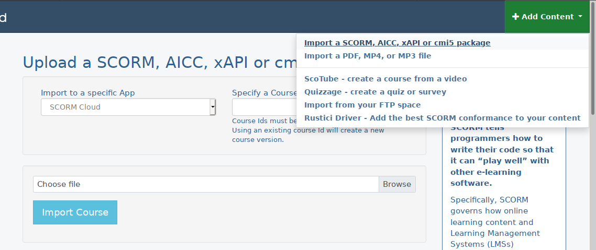
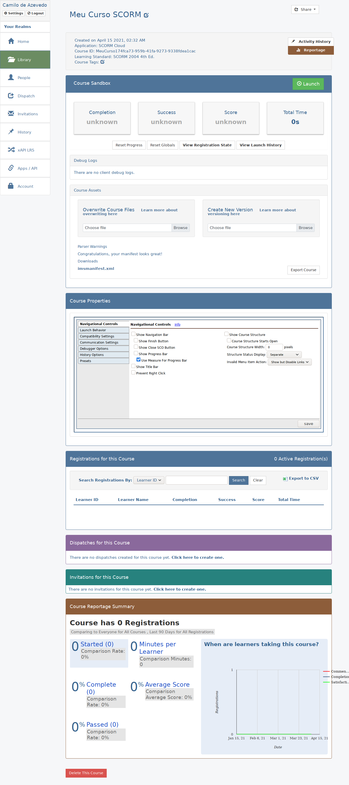

# Criando o arquivo SCORM

Agora que customizamos o conteúdo da pasta scormcontent com nossos conteúdos, fizemos a configuração necessária em scormdriver e atualizamos os arquivos imsmanifest.xml e metadata.xml com os dados do nosso curso vamos comprimi-los de volta em um arquivo SCORM.

Para isso devemos adicionar todos **os arquivos** em um zip (é importante que todos os arquivos estejam na raíz do zip, caso sejam zipados com uma pasta irá ocorrer um erro de leitura quando o LMS tentar ler o arquivo).

## Testando o arquivo no SCORM Cloud

Após comprimir os arquivos em um zip podemos subir esse arquivo e testar nosso arquivo SCORM no SCORM Cloud, após entrar na plataforma no canto superior direito clique em **Adicionar Conteúdo** (Add Content) e selecione a opção **Importar um pacote SCORM, AICC, xAPI ou cmi5** (Import a SCORM, AICC, xAPI or cmi5 package) que irá levar para uma tela como a abaixo.

Nessa tela vamos clicar no botão **Buscar** (Browse) à direita, selecionar o arquivo zipado em nosso computador e então clicar no botão azul **Importar Curso** (Import Course) e o curso será importado e você será automaticamente redirecionado para a página do mesmo.

Essa página (*print abaixo*) contêm todas as informações do SCORM lidas do arquivo e podemos iniciar nosso curso clicando em **Iniciar** (Launch) que irá abrir nosso curso em uma nova Janela, se passarmos algum tempo assistindo / lendo a janela e fecharmos vamos ver que o tempo de curso assistido foi atualizado. Esse menu de teste com as informações nos permite fazer qualquer ação com o SCORM, resetar conteúdo assistido, re-exportar para outro LMS... A única coisa que ainda não conseguimos fazer é marcar o curso como completo quando o usuário termina de assistir / ler / consumir o conteúdo o que é a próxima coisa que vamos fazer.

