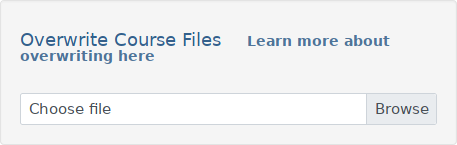

# Marcando o curso como completo após o usuário terminar de consumir

Até aqui vimos como criar um arquivo básico de SCORM, como fazer upload e iniciá-lo e podemos perceber que ele é capaz de registrar quanto tempo o aluno esteve consumindo o conteúdo, mas não que ele completou o curso.

Agora vamos fazer os ajustes necessários para que isso seja possível de uma forma simples. Para isso vamos fazer com que quando o usuário acessar a última página de conteúdo o curso seja marcado como completo.

Primeiramente precisaremos ter múltiplas páginas de conteúdo dentro de **scormcontent**.

index.html
```html
<!DOCTYPE html PUBLIC "-//W3C//DTD HTML 4.01//EN" "http://www.w3.org/TR/html4/strict.dtd">
<html><body>

    <p>Meu conteúdo LMS muito bonito!</p>
    
    <a href="./page2.html">Página 2</a>

</body></html>
```

page2.html
```html
<!DOCTYPE html>
<html lang="pt-BR">
    <head>
        <!-- aqui vamos incluir o JS -->
    </head>
    <body>
        <p>Página 2</p>
    </body>
</html>
```

Agora vamos importar o arquivo JS **AutoCompleteSCO.js** da pasta /scormdriver/auto-scripts/ que irá automaticamente marcar o curso como completo assim que a última página for carregada.

page2.html
```html
<!DOCTYPE html>
<html lang="pt-BR">
    <head>
        <script src="../scormdriver/auto-scripts/AutoCompleteSCO.js"></script>
    </head>
    <body>
        <p>Página 2</p>
    </body>
</html>
```

Agora precisamos novamente zipar nosso conteúdo em um novo zip.

## Atualizando o arquivo no SCORM Cloud

Após criarmos novamente nosso zip temos que entrar na página do nosso curso através da Biblioteca (Library) e clicar em Buscar (Browse) na seção Sobreescrever Arquivos do Curso (Overwrite Course Files) e selecionar o arquivo, o Cloud irá cuidar do resto e em poucos segundos o arquivo será atualizado. 



### Pronto
Agora é só testar e vai ver que o curso fica como Desconhecido (unknow) até que o usuário acesse a Página 2 através do link e após isso ele fica como Completado (completed), além de marcar por quanto tempo o conteúdo foi assistido.

Existem muitas outras formas de monitorar o acompanhamento de cada usuário utilizando SCORM, com barra de progresso, fazer o usuário clicar em um botão para marcar como completo ou quando o vídeo chega em algum tempo de execução, além de ter mais informações que podemos trabalhar, mas tudo isso vai ser visto à frente nos próximos tutoriais.

### Parabéns por chegar até aqui, você concluiu esse módulo
